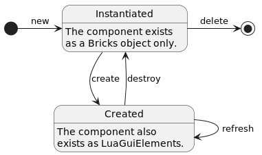

.. include:: /substitutions.rst

Module: GUI
===========

|Framework's| GUI module has three major features that simplify *creating* and *managing* GUIs:

1. |Framework's| *event handling* is an easy-to-use registry for event handler functions, that are called to handle GUI events on GUI components and ``LuaGuiElement``\s.
2. |Framework's| GUI *components* are a convenient way to declaratively build GUIs. Although they are compatible with Factorio's imperative style GUI API, they are most useful when the whole GUI is implemented using |Framework|.
3. |Framework's| *window manager* helps to manage multiple windows, e.g., modal dialogs.

Although each part of |Framework's| GUI API can be used in isolation, it is a good idea to let |Framework| handle all GUI related features in your mod. Feel free to contact me in case you have a scenario that |Framework| cannot handle fully and naturally.

See :ref:`full_example` for an example GUI using all three features.

**Note:** Because |Framework| stores, e.g., class ids as part of event handlers in Factorio's ``global`` table, it is necessary to update these values when the mod is updated. The simplest way to do this is to (by default) delete all |Framework| GUIs when your mod is updated.

.. _event_handling:

Event Handling
--------------

|Framework's| event handler for GUI events is an easy way to register function calls (and optionally their arguments) with an id string. This enables |Framework| to associate GUI events on ``LuaGuiElement`` with handler functions, as a ``LuaGuiElement`` can only store primitive type values in its tags.

The |Framework| ``EventHandler`` provides three basic functions:

* ``EventHandler:register(handler_table, function_name, ...)``
    Registers a call to ``handler_table:function_name(..., event)`` and returns an id for it. ``handler_table`` can be either ``nil`` (if ``function_name`` is the name of a globally available function), a |Framework| class, or an instance of a |Framework| class. ``function_name`` is the name of the function to be called on ``handler_table`` as a string. All further arguments will be passed on to the handler function.
* ``EventHandler:call(event_handler_id, event)``
    Calls the previously registered event handler with id ``event_handler_id``. It passes as arguments the registered arguments followed by the passed in ``event``.
* ``EventHandler:delete(event_handler)``
    Deletes a previously registered event handler. ``event_handler`` can be either a single event handler id, an array of ids. Alternatively, a valid ``LuaGuiElement`` can be passed, deleting all event handlers referenced in its tags.

To associate a ``LuaGuiElement`` with an event handler, simply provide its event handler id in the elements tags in a table called ``|mod_global_table|`` with the event's name as its key, e.g.:

.. literalinclude:: ../../../test_mod/src/examples/event_handling.lua
   :language: lua
   :linenos:
   :dedent:
   :start-after: -- listing-start
   :end-before: -- listing-end

This assumes that the various handler functions have been defined as follows:

.. literalinclude:: ../../../test_mod/src/examples/event_handling.lua
   :language: lua
   :linenos:
   :dedent:
   :start-after: -- prepare-listing-start
   :end-before: -- prepare-listing-end

Make sure to delete all event handlers of a ``LuaGuiElement`` before it is destroyed, e.g., by calling ``EventHandler:delete(button)``, to prevent orphaned event handlers.

Using |Framework's| components makes it even easier to handle events, because components automatically create a ``LuaGuiElement``'s tags and take care of deleting event handlers before their ``LuaGuiElement``\s are destroyed.

Components
----------

Components are the basic building block for |Framework| GUIs. They can be simple, e.g., a label or textfield, or complex, e.g., a window containing a table and three buttons.

Component Lifecycle
^^^^^^^^^^^^^^^^^^^

Key to using |Framework| components is to understand their lifecycle:

* **new:** Creates a new instance of the component class (see :doc:`/class_mechanism` for details on classes). Note that the component's ``LuaGuiElement``\s are not yet created.
* **create:** Creates the ``LuaGuiElement``\s visualizing the component. It is now in the *Created* state.
* **refresh:** Refreshes the created ``LuaGuiElement``\s with the current values from the component's instance.
* **destroy:** Destroys the component's ``LuaGuiElement``\s, moving it back to the *Instantiated* state. Again, just like after the *new* transition, the component no longer has any visible ``LuaGuiElement``\s.
* **delete:** Deletes the component instance.

Component Interface
^^^^^^^^^^^^^^^^^^^

Every |Framework| component (including the ones you define yourself) has to be (indirectly) derived from the ``Component`` class. ``Component`` provides default implementations for all lifecycle transitions, as well as some other functionality that is shared by all components. Custom components can override the default implementations (typically the ``new`` method to create a customized instance of the base component) and extend them with their own implementations. It should almost never be necessary to override something other than ``new``.

``Component`` provides the following interface:

* ``Component:new(args)``:
    Initializes a component instance with an optional ``args.name``. All values in ``args`` with numeric keys will be added as children to the component.
* ``Component:create(parent)``:
    Creates the component's ``LuaGuiElement``\s with ``parent`` as their parent ``LuaGuiElement`` (i.e. they are created using ``parent.add { ... }``. The default implementation simply passes this call to all children.
* ``Component:refresh()``:
    Refreshes the component's ``LuaGuiElement``\s. The default implementation simply passes this call to all children.
* ``Component:destroy()``:
    Destroys the component's ``LuaGuiElement``\s. The default implementation simply passes this call to all children.
* ``Component:delete()``:
    Deletes the component instance. The default implementation simply passes this call to all children.
* ``Component:get_state()``:
    Returns component's current lifecycle state (either ``Component.State.Instantiated` or ``Component.State.Created``).
* ``Component:get_name()``:
    Returns component's ``name``.
* ``Component:add_child(child)``:
    Adds ``child`` to component's children.
* ``Component:get_child(index_or_name)``:
    Returns component's ``child`` with index or name ``index_or_name``. Alternatively, children with a name can be directly accessed using ``<component_instance>.<child_name>``, e.g., ``flow.my_button`` for accessing a button with name "my_button" that was added to ``flow``.
* ``Component:get_children()``:
    Returns a read-only table containing all of component's children.
* ``Component:remove_child(index_or_name)``:
    Removes and returns component's child with index or name ``index_or_name``. If the child component is currently in the ``Component.State.Created`` state, the child will be destroyed before it is returned.
* ``Component:delete_child(index_or_name)``:
    Same as ``Component:remove_child(index_or_name)``, but additionally also calls ``delete`` on the child.
* ``Component:clear_children()``:
    Deletes all of component's children.

**Note:** The ``Component`` class provides implementations for adding children to a component, meaning *all* |Framework| components have that ability. This is similar to Factorio's ``LuaGuiElement``, where you can add children to, e.g., a label, as well. You can choose however to ignore those children in your custom component's ``create`` implementation, if it does not make sense to add children to it.

Factorio Components
^^^^^^^^^^^^^^^^^^^

|Framework| provides pre-implemented components for all subtypes of `LuaGuiElement <https://lua-api.factorio.com/latest/LuaGuiElement.html>`_. They are available under ``|mod_folder|.GUI.Factorio`` and named after the subtype converted to camel case, e.g., component ``ChooseElemButton`` for subtype ``choose-elem-button``.

The Factorio components have a straightforward interface, which makes them usable in a similar way to the built-in ones:

* Their ``new`` method takes all arguments that are listed under `LuaGuiElement.add <https://lua-api.factorio.com/latest/LuaGuiElement.html#LuaGuiElement.add>`_ for the component's subtype, e.g., flow's ``direction``: ``Flow:new { direction = 'horizontal' }``. Additionally, you can also pass any other of subtype's writeable attributes that are not listed, e.g., flow's ``drag_target``.

* They have a getter method called ``<ComponentClass>:get_<attribute>`` for each attribute of the component's subtype, as well as a setter called ``<ComponentClass>:set_<attribute>`` for the writeable attributes.

* The setter for a components ``style`` attribute (and also ``new``) accepts style names (like ``LuaGuiElement``\s) as a string, as well as tables for modifying the styles directly, for example:

    .. code-block:: lua

        -- sets label's style to the built-in 'caption_label':
        Label:new { style = 'caption_label' }
        -- keeps label's current style and sets style.width = 120
        Label:new { style = { width = 120 } }
        -- sets label's style to the built-in 'caption_label' and additionally sets label's style.width = 120
        Label:new { style = { 'caption_label', width = 120 } }

* For |Framework| to be able to keep track of a component's tags, ``<ComponentClass>:get_tags()`` returns a read-only of the tags. To modify them, use methods ``<ComponentClass>:set_tags(tags)``, ``<ComponentClass>:update_tags(tags)``, and ``<ComponentClass>:delete_tags(tags)``.

* Most methods listed for `LuaGuiElement <https://lua-api.factorio.com/latest/LuaGuiElement.html>`_ can be called on components: ``<ComponentClass>:<method_name>(...)``. Note that the component has to be in ``Component.State.Created` state to be able to call ``LuaGuiElement``'s methods.

* Factorio components seamlessly integrate with |Framework's| event handling. Simply pass one or multiple event handler ids to a component's ``new`` function with the event name as key, e.g., ``Button:new { on_gui_click = EventHandler:register(...) }``. By default, the component takes ownership of the event handler and deletes it when the component gets deleted. You can prevent that by passing ``delete_event_handler = false`` to ``new`` as well.

    Outside of ``new``, on or multiple event handlers can be added to a component via ``ComponentClass:add_<event_name>(event_handler)``, e.g., ``my_button:add_on_gui_click(EventHandler:register(...))``.

Creating Components
^^^^^^^^^^^^^^^^^^^

Custom components are derived from ``Component`` or any other previously defined component, e.g., ``Flow``. Typically, a custom component overrides the base components ``new`` function to create a customized instance of the base component, and adds getters and setters to interact with the custom component.

The following simple example illustrates how to create custom components by implementing a simple *spinner textfield*. It is a numeric textfield with two buttons for decreasing and increasing the textfield's value:

.. literalinclude:: ../../../test_mod/src/examples/creating_components.lua
   :language: lua
   :linenos:

.. _window_manager:

Window Manager
--------------

The window manager keeps track of the windows opened by your mod. It establishes a hierarchy (more precisely a stack) of windows per GUI available under ``player.gui``, e.g., ``screen``, which allows easily implementing modal dialogs, for example.

``WindowManager`` provides the following interface:

* ``WindowManager:open(anchor, window_or_class, ...)``

    Creates the ``window_or_class`` if it is an instance of |Framework's| ``Window`` or any derived class. Instantiates and then creates it, if ``window_or_class`` is |Framework's| ``Window`` or any derived class itself. All further arguments are passed to the classes ``new`` function.
    Anchor is one of the values of enum ``WindowManager.Anchor``, e.g., ``WindowManager.Anchor.screen(player)`` for creating windows in ``player.gui.screen``. All windows below the new window in the stack will have their ``ignored_by_interaction`` attribute set to ``true``, allowing input only to the topmost window.

* ``WindowManager:close(window_or_anchor, delete, delete_in_front)``

    Destroys ``window_or_anchor``. If ``window_or_anchor`` is a window, it and all windows on top of it in the stack will be destroyed.
    If ``window_or_anchor`` is an anchor, all windows in the anchor's stack will be destroyed. When the optional parameter ``delete`` is omitted or set to ``true``, the window will also be deleted (i.e. its ``delete`` function will be called). When the optional parameter ``delete_in_front`` is omitted or set to ``true``, the windows on top of ``window_or_anchor`` will also be deleted.

The following listing illustrates the usage of ``WindowManager`` and ``Window``. It creates a simple test window every time the command ``/open_window`` is executed in Factorio's console. When multiple windows are opened, only the top one can be moved around and closed. Executing command ``/close_all_windows`` closes all previously opened windows.

.. literalinclude:: ../../../test_mod/src/examples/window_manager.lua
   :language: lua
   :linenos:

.. _full_example:

Full Example
------------

This section provides a full example using all three major features of |Framework's| GUI module: custom components, event handling, and managing multiple windows. The example will implement a simple, manual counter GUI, where the player can enter a caption and update a number. For this, we implement a custom SpinnerLabel component that is a numeric label with two buttons for increasing and decreasing its value. We will use the window manager to display the counter GUI and show a modal dialog for entering the counter's caption.

Each listing in this section has a filename shown as its caption at the top. You can test this example by copying the listings into files with these names.

Let's start with the SpinnerLabel:

.. literalinclude:: ../../../test_mod/src/examples/SpinnerLabel.lua
   :language: lua
   :linenos:
   :caption: SpinnerLabel.lua

Additionally, we create a custom dialog to enter a caption for the counter:

.. literalinclude:: ../../../test_mod/src/examples/CaptionDialog.lua
   :language: lua
   :linenos:
   :caption: CaptionDialog.lua

We can now create the counter GUI using these components in ``control.lua``:

.. literalinclude:: ../../../test_mod/src/examples/full_example_control.lua
   :language: lua
   :linenos:
   :caption: control.lua
